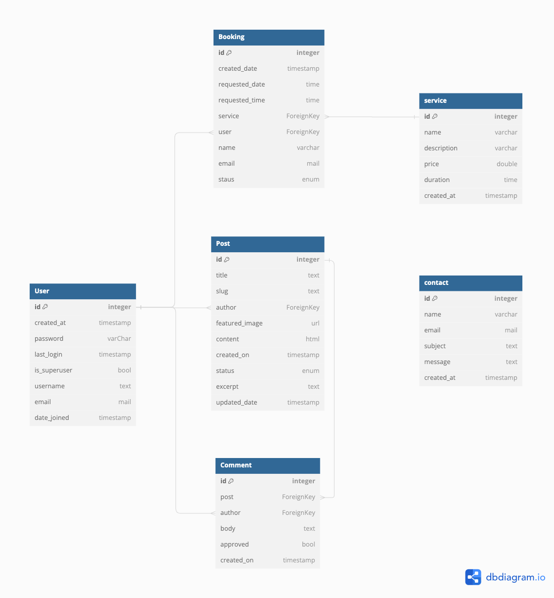
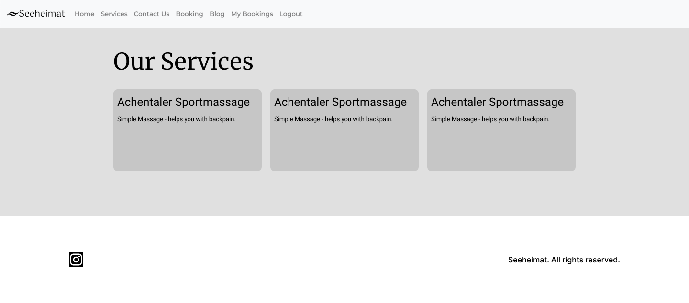
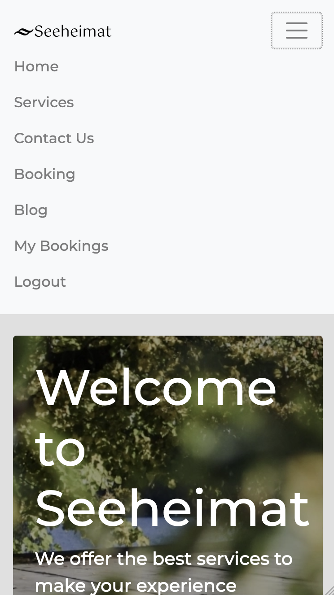
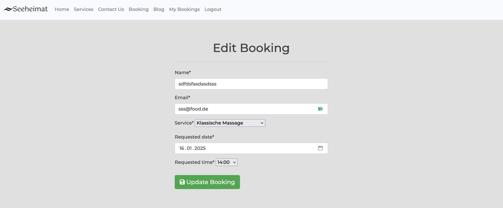
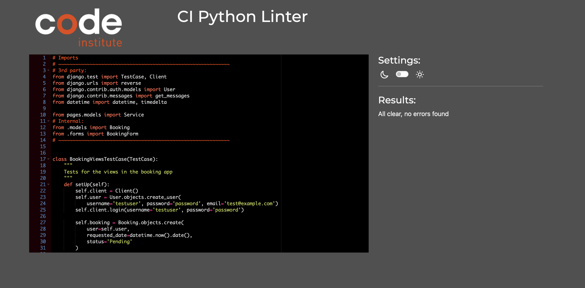

# Seeheimat | alps ~ wellness

**Developer: Paul Pfister**

💻 [Visit live website](https://)  
(Ctrl + click to open in new tab)

## Table of Contents

- [About](#about)
- [User Goals](#user-goals)
- [Site Owner Goals](#site-owner-goals)
- [User Experience](#user-experience)
- [User Stories](#user-stories)
- [Design](#design)
  - [Colors](#colors)
  - [Structure](#structure)
    - [Website pages](#website-pages)
    - [Database](#database)
  - [Wireframes](#wireframes)
- [Technologies Used](#technologies-used)
- [Features](#features)
- [Validation](#validation)
- [Testing](#testing)
  - [Manual testing](#manual-testing)
  - [Automated testing](#automated-testing)
  - [Tests on various devices](#tests-on-various-devices)
  - [Browser compatibility](#browser-compatibility)
- [Bugs](#bugs)
- [Heroku Deployment](#heroku-deployment)
- [Credits](#credits)
- [Acknowledgements](#acknowledgements)

### About

Seeheimat | alps ~ wellness is a business concept that offers wellness wellness treatments, gastro and accommodation all in one place - Seeheimat - translated from German means "home at the lake". The business is not existent right now but the concept is to offer a place where people can relax, eat and sleep all in one place. The business is located in the alps so the name is fitting for the location.

### User Goals

- To create a booking for treatment service
- To be able to view edit and cancel bookings
- To view menus, a blog and contact info
- Fully responsive and accessible

### Site Owner Goals

- To provide a full web applicationto handle the bookings
- to organize the bookings and plan for the future
- Provide a modern application with an easy navigation

## User Experience

### Target Audience

- Tourists visiting the area
- Past and new customers for the business
- People looking for a wellness treatment
- People with backpain or other issues that need treatment

### User Requirements and Expectations

- Fully responsive
- Accessible
- A welcoming design
- Social media
- Contact information
- Accessibility

##### Back to [top](#table-of-contents)

## User Stories

### Users

1. As a site user I can easily navigate through the site (Must have)
2. As a site user I can easily navigate through the site and see informations (Must have)
3. As a site user I want to see the team members of the company (Should have)
4. As a site user I want to easily contact the site owner (Must have)
5. As a site user I want to see the opening hours and the location of the company (Should have)
6. As a site user I want to easily book an appointment (Must have)
7. As a site user I want to read my bookings (Must have)
8. As a site user I want to update my booking (Must have)
9. As a site user I want to be able to delete my booking (Must have)
10. As a site user I want to get notified if an Action took place - so the site needs to write a message when operation with CRUD operations (Must have)
11. As a site user I expect that the site works on all common devices (Must have)
12. As a site user i want to see what services I can book (Must have)
13. As a User I can not book a service at a time already booked so that my booking is valid and not double booked (Must have)
14. As a site user I want to book valid appointments - no dates in the past (Must have)
15. As a site user i want to login to CRUD my bookings (Must have)
16. As a site user I need to sign up to book an appointment (Must have)
17. As a site user I expect that just myself and the admin can see my bookings - so the bookings need to be filtered (Must have)

### Admin / Authorised User

18. As a site admin i can make a booking for my customers (Must have)
19. As a site admin I need to read all bookings and appointments (Must have)
20. As a site admin I need to be able to update all bookings (Must have)
21. As a site admin I need to be able to delete all bookings (Must have)
22. As an site admin I need to be able to to manage all bookable services (Must have)

### Site Owner

23. As a site owner I want to ship new informations and news into my blog so my current customers can get additional informations (Should have)
24. As a site owner I want that nobody can book the same appointment at a time (Must have)
25. As a site owner I need to accept or reject bookings to handle time (Must have)

### Milestones & User Stories

- GitHub Kanban was used to track all open user stories
- Milestones were used to track the progress of the project

Milestones

w

User Stories

##### Back to [top](#table-of-contents)

## Design

### Colors

I chose more light colors with low contrast to give the user a relaxing feeling when visiting the site. The colors are also used to give the user a feeling of being in the alps.

### Structure

#### Website pages

The site was designed to be easy to navigate and user friendly. The user should immediately see what the business is for and what the offer is.

The footer also contains a social media link to the business' instagram site.

- The site consists of the following pages:
  - Home
  - Register
  - Login
  - Logout
  - Bookings
  - Bookings List
  - Edit Booking
  - Contact Us
  - Services (Treatments)
  - Blog
  - Blog Post Details
  - 404 Page
  - 500 Page

#### Database

- Built with Python and the Django framework with a database of CodeInstitute's Postgres - the project is deployed with heroku

Show diagram

##### User Model

The User Model contains the following:

- user_id
- password
- last_login
- is_superuser
- username
- email
- date_joined

##### Service Model

The Service Model contains the following:

- service_id
- name
- description
- price
- duration

##### Contact Model

The Contact Model contains the following:

- message_id
- name
- email
- subject
- message
- created_at

##### Booking Model

The Booking Model contains the following:

- booking_id (PrimaryKey)
- created_date
- requested_date
- requested_time
- service (ForeignKey)
- user (ForeignKey)
- name
- email
- status

##### Post Model

The Post Model contains the following:

- post_id (PrimaryKey)
- title
- slug
- author (ForeignKey)
- featured_image
- content
- created_on
- status
- excerpt
- updated_date

##### Comment Model

The Comment Model contains the following:

- comment_id (PrimaryKey)
- post (ForeignKey)
- author (ForeignKey)
- body
- approved
- created_on

### Wireframes

The wireframes were created using Balsamiq

#### Home

#### Blog

#### My Bookings

#### booking

#### Contact Page

#### Login

#### Services

## Technologies Used

### Languages & Frameworks

- HTML
- CSS
- Javascript
- Python
- Django

### Libraries & Tools

- [Am I Responsive](http://ami.responsivedesign.is/)
- [Figma](https://figma.com/)
- [Bootstrap v4.5](https://getbootstrap.com/)
- [Cloudinary](https://cloudinary.com/)
- [Favicon.io](https://favicon.io)
- [Chrome dev tools](https://developers.google.com/web/tools/chrome-devtools/)
- [Font Awesome](https://fontawesome.com/)
- [Git](https://git-scm.com/)
- [GitHub](https://github.com/)
- [Google Fonts](https://fonts.google.com/)
- [Heroku Platform](https://id.heroku.com/login)
- [jQuery](https://jquery.com)
- [Postgres](https://dbs.ci-dbs.net/)
- [Summernote](https://summernote.org/)
- Validation:
  - [WC3 Validator](https://validator.w3.org/)
  - [Jigsaw W3 Validator](https://jigsaw.w3.org/css-validator/)
  - [JShint](https://jshint.com/)
  - [CI Python Linter](https://pep8ci.herokuapp.com/)
  - [Lighthouse](https://developers.google.com/web/tools/lighthouse/)
  - [Wave Validator](https://wave.webaim.org/)

##### Back to [top](#table-of-contents)

## Features

### Home page

- Home page includes nav bar, main body and a footer

User Stories covered: 1, 2

See feature images

### Logo & Navigation

- Custom logo for the business
- Fully Responsive
- On small screens switches to hamburger menu
- Indicates login/logout in status
- displayed on all pages

User Stories covered: 1, 2

See feature images

### Footer

- Contains social media links and copyright
- displayed across all pages

User Stories covered: 1, 2

See feature images

### Sign up / Register

- Allow users to register an acoount
- Username and password is required, email is optional

User Stories covered: 16

See feature images

### Login

- User can login to create a booking, view bookings, edit and delete bookings

User Stories covered: 15

See feature images

### Logout

- Allows the user to securely log out
- Ask user if they are sure they want to log out

User Stories covered: 15

See feature images

### Book

- Allows the user to book a service using the booking form
- Messages are displayed if the data is not valid such as phone number lenght is too short and the email address is not a valid format

User Stories covered: 6

See feature images

### My Bookings

- Allows the user to see all their bookings in a paginated layout
- Status of the booking is displayed, awaiting confirmation and when approved will then change to confirmed status for the user

User Stories covered: 7

See feature images

### Edit Booking

- Allows the user to edit their entire booking and update the booking

User Stories covered: 8

See feature images

### Cancel Booking

- Allows the user to cancel their booking, asks user are they sure

User Stories covered: 9

See feature images

### Services

- The services page displays all available treatments
- Items can be added via the admin panel in the backend
- A service which is shown here - is always bookable

User Stories covered: 12

See feature images

### Blog

- The blog displays posts made in the admin panel
- Paginations is used to display 4 posts per page

User Stories covered: 23

See feature images

### Post Details

- The post details page displays the full post
- The author, date and content is displayed

User Stories covered: 23

See feature images

### Comments

- Comments can be made on each post
- Comments can be approved or rejected by the admin
- Only registered users can comment

User Stories covered: 23

See feature images

### Contact Us

- Registered users can contact the business
- Name, email, subject and message is required
- The message is displayed in the admin panel

User Stories covered: 4

See feature images

##### Back to [top](#table-of-contents)

## Validation

The W3C Markup Validation Service

Home

Post Details

Post List

Book a Service

My Bookings

Contact

Login

Logout

Services

404

### CSS Validation

The W3C Jigsaw CSS Validation Service

Style.css

### JavaScript Validation

JSHint JS Validation Service

Script.js

comment.js

### PEP8 Validation

The tool CI Python Linter was used - 

blog

admin.py

apps.py

forms.py

models.py

urls.py

views.py

booking

admin.py

apps.py

forms.py

models.py

test_models.py

test_urls.py

test_views.py

urls.py

views.py

contact

admin.py

apps.py

forms.py

models.py

urls.py

views.py

pages

admin.py

apps.py

models.py

urls.py

views.py

### Lighthouse

Performance, best practices and SEO was tested using Lighthouse.

#### Desktop

Home

Sign Up

Login

Book a Service

My bookings

Contact

Post Details

Post List

Services

### Wave

WAVE was used to test the websites accessibility.

Index

Book a Service

Contact

Login

Signup

Post list

Post details

My Bookings

##### Back to [top](#table-of-contents)

## Testing

1. Manual testing
2. Automated testing

### Manual testing

1. As a site user I can easily navigate through the site
2. As a site user I can easily navigate through the site and see informations

| **Step**                                                 | **Expected Result**           | **Actual Result** |
| -------------------------------------------------------- | ----------------------------- | ----------------- |
| Click on the 'Home' link in the navigation bar           | Homepage will load            | Works as expected |
| Click on the 'Register' link in the navigation bar       | Sign up page will load        | Works as expected |
| Click on the 'Login' link in the navigation bar          | Login page will load          | Works as expected |
| Click on the 'Service' link in the navigation bar        | Service page will load        | Works as expected |
| Click on the 'Contact us' link in the navigation bar     | Contact Page will load        | Works as expected |
| Click on the 'Booking' link in the navigation bar        | Book a service page will load | Works as expected |
| Click on the 'My Bookings' link in the navigation bar    | My Booking page will load     | Works as expected |
| Click on the 'Blog' link in the navigation bar           | Blog list page will load      | Works as expected |
| Click on the 'Seeheimat' logo link in the navigation bar | Homepage will load            | Works as expected |
| Click on the 'Logout' link in the navigation bar         | Logout page will load         | Works as expected |

Evidence

3. As a site user I want to see the team members of the company

| **Step**                                    | **Expected Result**     | **Actual Result** |
| ------------------------------------------- | ----------------------- | ----------------- |
| Scroll down on the homepage to see the team | Members section appears | Works as expected |

Evidence

4. As a site user I want to easily contact the site owner

| **Step**                                             | **Expected Result** | **Actual Result** |
| ---------------------------------------------------- | ------------------- | ----------------- |
| Click on the 'Contact Us' link in the navigation bar | Find contact form   | Works as expected |

Evidence

5. As a site user I want to see the opening hours and the location of the company

| **Step**                    | **Expected Result**                                        | **Actual Result** |
| --------------------------- | ---------------------------------------------------------- | ----------------- |
| Scroll down on the homepage | Find the opening hours and the location (Google maps Link) | Works as expected |

Evidence

6. As a site user I want to easily book an appointment

| **Step**                      | **Expected Result**                     | **Actual Result** |
| ----------------------------- | --------------------------------------- | ----------------- |
| Click on "Booking" in nav bar | Enter your data and book an appointment | Works as expected |

Evidence

7. As a site user I want to read my bookings

| **Step**                          | **Expected Result**                                  | **Actual Result** |
| --------------------------------- | ---------------------------------------------------- | ----------------- |
| Click on "My Bookings" in nav bar | See your already booked appointments with pagination | Works as expected |

Evidence

8. As a site user I want to update my booking

| **Step**                             | **Expected Result**              | **Actual Result** |
| ------------------------------------ | -------------------------------- | ----------------- |
| Click on "Edit" at your booking card | You can update now all your data | Works as expected |

Evidence

9. As a site user I want to be able to delete my booking

| **Step**                               | **Expected Result**                    | **Actual Result** |
| -------------------------------------- | -------------------------------------- | ----------------- |
| Click on "Delete" at your booking card | Delete your booking in the delete view | Works as expected |

Evidence

10. As a site user I want to get notified if an Action took place - so the site needs to write a message when operation with CRUD operations

| **Step**                                                             | **Expected Result**                | **Actual Result** |
| -------------------------------------------------------------------- | ---------------------------------- | ----------------- |
| Performing any CRUD (except Read) operation (Create, Update, Delete) | a message will be sent to the view | Works as expected |

Evidence

11. As a site user I expect that the site works on all common devices

| **Step**                                        | **Expected Result**   | **Actual Result** |
| ----------------------------------------------- | --------------------- | ----------------- |
| open the app on desktop, smartphones or tablets | the app is responsive | Works as expected |

Evidence

12. As a site user i want to see what services I can book

| **Step**                        | **Expected Result**           | **Actual Result** |
| ------------------------------- | ----------------------------- | ----------------- |
| Click on services in the navbar | See what services are offered | Works as expected |

Evidence

13. As a User I can not book a service at a time already booked so that my booking is valid and not double booked

| **Step**                                  | **Expected Result**        | **Actual Result** |
| ----------------------------------------- | -------------------------- | ----------------- |
| Create a booking twice - at the same time | The booking cannot be made | Works as expected |

Evidence

14. As a site user I want to book valid appointments - no dates in the past

| **Step**                               | **Expected Result**                                        | **Actual Result** |
| -------------------------------------- | ---------------------------------------------------------- | ----------------- |
| Make a booking and select the calendar | The calendar is not able to accept past dates for bookings | Works as expected |

Evidence

15. As a site user i want to login to CRUD my bookings

| **Step**                                        | **Expected Result**                            | **Actual Result** |
| ----------------------------------------------- | ---------------------------------------------- | ----------------- |
| Click on the 'Login' link in the navigation bar | after you logged in you can CRUD your bookings | Works as expected |

Evidence

16. As a site user I need to sign up to book an appointment

| **Step**                           | **Expected Result**                                         | **Actual Result** |
| ---------------------------------- | ----------------------------------------------------------- | ----------------- |
| click on bookings while logged out | you will see that login is required and you need to sign up | Works as expected |

Evidence

17. As a site user I expect that just myself and the admin can see my bookings

| **Step**                                              | **Expected Result**                                                | **Actual Result** |
| ----------------------------------------------------- | ------------------------------------------------------------------ | ----------------- |
| Click on the 'My Bookings' link in the navigation bar | You will see just your bookings that you created with your account | Works as expected |

Evidence

18. As a site admin i can make a booking for my customers

| **Step**                             | **Expected Result**                  | **Actual Result** |
| ------------------------------------ | ------------------------------------ | ----------------- |
| in the admin panel - select bookings | You can add a booking if you need to | Works as expected |

Evidence

19. As a site admin I need to read all bookings and appointments

| **Step**                             | **Expected Result**                        | **Actual Result** |
| ------------------------------------ | ------------------------------------------ | ----------------- |
| In the admin panel - select bookings | You will see overview of all bookings made | Works as expected |

Evidence

20. As a site admin I need to be able to update all bookings

| **Step**                                                                         | **Expected Result**                     | **Actual Result** |
| -------------------------------------------------------------------------------- | --------------------------------------- | ----------------- |
| In the admin panel - select bookings and click on the booking you want to update | you can change all data on this booking | Works as expected |

Evidence

21. As a site admin I need to be able to delete all bookings

| **Step**                                                                 | **Expected Result**         | **Actual Result** |
| ------------------------------------------------------------------------ | --------------------------- | ----------------- |
| In the admin panel - select bookings and check the booking and delete it | you can delete this booking | Works as expected |

Evidence

22. As an site admin I need to be able to to manage all bookable services

| **Step**                             | **Expected Result**                   | **Actual Result** |
| ------------------------------------ | ------------------------------------- | ----------------- |
| In the admin panel - select services | Here you can manage all your services | Works as expected |

Evidence

23. As a site owner I want to ship new informations and news into my blog so my current customers can get additional informations

| **Step**                                                                 | **Expected Result**                 | **Actual Result** |
| ------------------------------------------------------------------------ | ----------------------------------- | ----------------- |
| In the blog - the owner can create new content regarding to the business | a full working blog app is provided | Works as expected |

Evidence

24. As a site owner I want that nobody can book the same appointment at a time

| **Step**                              | **Expected Result**        | **Actual Result** |
| ------------------------------------- | -------------------------- | ----------------- |
| Try to book services at the same time | Error message is displayed | Works as expected |

Evidence

25. As a site owner I need to accept or reject bookings to handle time

| **Step**                                                                                   | **Expected Result**                         | **Actual Result** |
| ------------------------------------------------------------------------------------------ | ------------------------------------------- | ----------------- |
| in the admin panel - select bookings and update the bookings you want to reject or confirm | Reject or Confirmation is shown to the user | Works as expected |

Evidence

### Automated testing

- Testing was done using the built in Django module. All tests ran at the same time and all passed.

Seeheimat - Booking - test_models.py, test_urls.py, test_views.py

### Device Testing & Browser compatibility

I used different browsers with my Macbook Pro and also tested it on my Oneplus 8. The app was also tested using th built in developer tools for different devices in Firefox.

Google Chrome - Browser

Firefox - Browser

Galaxy S 20 - Emulator

Ipad - Emulator

IPhone SE - Emulator

Safari Browser

##### Back to [top](#table-of-contents)

## Bugs

| **Bug**                                                                          | **Fix**                                                                                                                                                             |
| -------------------------------------------------------------------------------- | ------------------------------------------------------------------------------------------------------------------------------------------------------------------- |
| css not loading                                                                  | I created the css file in the generated staticfiles folder and not in the static folder - after that I jsut needed to generate the new staticfiles and it was fixed |
| Double bookings - the user was able to book a different service at the same time | Adjusted the meta (unique together) in the booking model to prevent this situation                                                                                  |
| 500 internal server error while changing the booking models                      | I needed to truncate the whole database via the terminal in order to be able to migrate the new models                                                              |
| server error - base.html was not loaded properly                                 | I needed to be sure to put base.html in every file to the top                                                                                                       |
| static files couldn't be accessed                                                | I needed to implement whitenoise to the settings.py                                                                                                                 |

##### Back to [top](#table-of-contents)

### Heroku Deployment

[Official Page](https://devcenter.heroku.com/articles/git) (Ctrl + click)

This application has been deployed from Github using Heroku. Here's how:

1. Create an account at heroku.com

2. Create an app and select a region

3. Connect your github account and select the repository you want to deploy

4. Enable automatic deploys to deploy the app every time you push to the main branch

5. Run pip3 freeze > requirements.txt in order to add the requirements.txt file

6. Create the Procfile for heroku

7. Add the heroku domain to the ALLOWED_HOSTS variable in settings.py

8. Ensure debug is set to false in the settings.py file

9. Add the python buildpack in heroku settings

10. Integrate the environment variables from the .env file into the heroku app settings

11. add the runtime.txt file to the root of the project with the python version

12. Deploy your project to heroku by pushing to the main branch

### Fork Repository

To fork the repository by following these steps:

1. Go to the GitHub repository
2. Click on Fork button in upper right hand corner

### Clone Repository

You can clone the repository by following these steps:

1. Go to the GitHub repository
2. Locate the Code button above the list of files and click it
3. Select if you prefere to clone using HTTPS, SSH, or Github CLI and click the copy button to copy the URL to your clipboard
4. Open Git Bash
5. Change the current working directory to the one where you want the cloned directory
6. Type git clone and paste the URL from the clipboard ($ git clone https://github.com/YOUR-USERNAME/YOUR-REPOSITORY)
   7.Press Enter to create your local clone.

##### Back to [top](#table-of-contents)

## Credits

### Images

Images are made by myself or by midjourney.

### Code

Bootstrap dark navigation theme was used alongside boostrap classes and carousel

##### Back to [top](#table-of-contents)

## Acknowledgements

### Special thanks to the following:

- My Mentor Mo Shami
